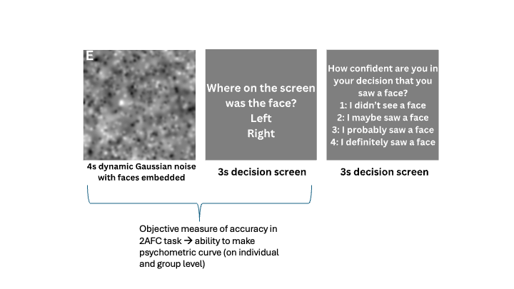
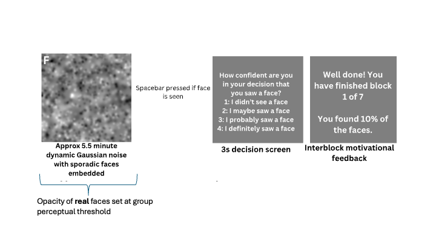

```{r setup, include=FALSE}
knitr::opts_chunk$set(echo = TRUE)
```

```{r, include = FALSE}
library(tidyverse)
library(lme4)
library(boot)
library(gridExtra)
library(patchwork)
library(grid)
library(ggpubr)
```


# Pareidolia task
The pareidolia task is divided into a 'training' experiment and a 'main' experiment.

## Training experiment
The training experiment consists of a 2AFC task over 120 trials divided into 7 blocks. Participants are asked to report the direction of faces embedded within four-seconds of dynamic Gaussian noise, and to give their confidence in the perceived direction of these faces afterwards. Faces are presented at opacities ranging from 10% to 70%. We are able to plot individual and group psychometric curves using the accuracy from this task.

```{r, echo=FALSE}

```

## Main experiment
The main experiment is a detection task. Participants job is to find difficult-to-find faces in approximately 5.5 minutes of continuous dynamic Gaussian noise, and to give their confidence in their decisions afterwards. There is a pseudo-trial structure of 120 2.5 seconds for analysis purposes, but this is not shown to the participants. Faces are shown on 30 out of 120 of these trials.

The opacity of **real** faces in the main experiment is originally set at the group threshold for achieving 65% accuracy in the training task. This opacity adaptively updates per block, based on the performance of the block. If participants find less than 10% of the real faces, the opacity of real faces increases by 1% in the next block, whereas if participants find more than 90% of real faces, the opacity of real faces decreases by 1% in the next block. 


```{r, echo=FALSE}

```

### Upcoming analysis decisions
This document provides an summary of data with regards to two decisions that we are hoping to make with regards to the pareidolia task.

* What opacity level should faces be set at in the main experiment? Should we be using an individual threshold or shall we continue to use a group threshold?
* How should we adjust block-wise adjustment in the main experiment?

### The data set

This data-set consists of pilot data from 41 participants. Half of these participants begin the experiment at an opacity of 26%, based on data from an earlier pilot experiment. After collecting data for the half of participants, the group perceptual threshold for the remaining participants was readjusted to 28%. 

#### Import data-sets
Here is a description of all the columns of the **training** data-set
**Face_response** = Whether the participant responded (should always be 1)
**Face_confidence** = The confidence decision associated with the direction, from 1-4
**Face_Onset_Time**= the time in the block that the face was presented
**Face_Position** = the degrees of visual angle the face was presented at, where negative values are on the left and positive values on the right
**Noise_Number** = the label of the noise .png shown when the face was presented
**Face_Size** = the size (in visual angle) of the face shown
**Opacity** = the opacity the face was shown (from 0.1-0.7)
**Direction_Report** = whether a participant said that the face is on the left (1) or right (2)
**subnumber** = the subject number
**block_number**= the block number

```{r import training_data}
training_data <- read.csv("Data/training_data.csv")[ , -1]
```

Here is a description of all the columns of the **main** data-set
**Realface_response** = Whether the trial was a face-present trial (0 or 1, depending on whether the face was detected); or whether the trial was a face-absent trial (80)
**Realface_confidence** = If the trial had a face, the confidence (1-4) if it was detected. If it was not detected, it will be an NA
**Realface_Image_Onset_Time**= the time in the block that the face was presented (0 if not a face trial)
**RealFace_Image_Response_Time** = the time in the block that the face was detected (0 if not a face trial)
**Hallucination_response** = Whether the trial was a face-present trial (90), and whether a false face (hallucination), was detected (0/1)
**Hallucination_confidence** = if there was a false alarm/face hallucination (hallucination_response = 1), then what was the confidence of this false alarm
**Noise_Onset_Time** = The time stamp of the noise trial where there was a face-absent trial
**Hallucination_Response_Time** = the time in the block that the false alarm was reported
**ConfidenceScreen_Onset** = When there was a hit or false alarm, the time that the confidence screen was presented after the response
**Face_Position** = the degrees of visual angle the face was presented at, where negative values are on the left and positive values on the right
**Noise_Number** = the label of the noise .png shown when the face was presented
**Face_Size** = the size (in visual angle) of the face shown
**subnumber** = the subject number
**block_number**= the block number
**Opacity** = the opacity the face was shown 

```{r import main_data}
main_data <-  read.csv("Data/main_data.csv")[ , -1]
```

#### Question 1 - should we be using group or inidividual psychometric curves?
##### Plot psychometric curves from training data
We first classify each trial as correct (1) or incorrect (0) based on an individuals direction report and face position: Direction_Report 1 = left, 2 = right; negative face position = left; positive face position = right.
```{r clean_training}
training2 <- training_data %>%
  mutate(
    Correct_Response = case_when(
      Direction_Report == 1 & Face_Position < 0 ~ 1,  # Left reported, face on left
      Direction_Report == 2 & Face_Position > 0 ~ 1,  # Right reported, face on right
      TRUE                                       ~ 0  # anything else (incorrect reponse)
    )
  )
```

We then fit a group-level psychometric curve for accuracy by fitting a multi-level logistic regression across all participants and bootstrapping to estimate the 95% CI 

```{r bootstrap 65 percent}
# fit model
model <- glmer(
  Correct_Response ~ Opacity + (1 | subnumber),
  family = binomial(link = "logit"),
  control = glmerControl(optimizer = "bobyqa"),
  data = training2
)

# function to compute threshold at 65%
threshold_fun <- function(fit) {
  coefs <- fixef(fit)  # fixed effects
  intercept <- coefs[1]
  slope <- coefs[2]
  
  # solve for opacity at p = 0.65
  p <- 0.65
  logit_p <- log(p / (1 - p))
  threshold <- (logit_p - intercept) / slope
  return(threshold)
}

# bootstrap function wrapper
boot_fun <- function(data, indices) {
  d <- data[indices, ]
  fit <- try(glmer(
    Correct_Response ~ Opacity + (1 | subnumber),
    family = binomial(link = "logit"),
    control = glmerControl(optimizer = "bobyqa"),
    data = d
  ), silent = TRUE)
  
  if (inherits(fit, "try-error")) return(NA)
  return(threshold_fun(fit))
}

# run bootstrap
set.seed(123)
boot_res <- boot(training2, statistic = boot_fun, R = 1000)

# bootstrap estimate
boot_res$t0   # original estimate
# confidence interval
boot.ci(boot_res, type = "perc")
```

We can plot this psychometric curve on a group level below.
```{r group psychometric curve}
# estimate of the opacity threshold at 65% correct. 
# Extract bootstrap results
threshold_ml <- boot_res$t0  # original GLMER threshold estimate
ci <- boot.ci(boot_res, type = "perc")
ci_lower <- ci$percent[4]   # lower bound
ci_upper <- ci$percent[5]   # upper bound

#get fixed effects
fe <- fixef(model)  # from your glmer model

# summarise proportion correct for plotting
summarised_data <- training2 %>%
  group_by(Opacity) %>%
  summarise(Proportion_Correct = sum(Correct_Response) / n())

# create prediction from glm
pred_data <- data.frame(
  Opacity = seq(min(training2$Opacity), max(training2$Opacity), length.out = 300)
)
pred_data$Predicted <- plogis(fe[1] + fe[2] * pred_data$Opacity)

# plot
psychometric <- ggplot(summarised_data, aes(x = Opacity, y = Proportion_Correct)) +
  geom_point(alpha = 0.7, size = 2) +
  # Fitted curve from the fixed effects of the mlm
  geom_line(data = pred_data, aes(x = Opacity, y = Predicted),
            color = "#d95f02", linewidth = 1.5) +
  # Shaded CI region for the threshold
  ggplot2::annotate("rect",
           xmin = ci_lower, xmax = ci_upper,
           ymin = -Inf, ymax = Inf,
           fill = "red", alpha = 0.15) +
  # Threshold line
  geom_vline(xintercept = threshold_ml, linetype = "dashed",
             color = "red", linewidth = 1) +
  # Threshold label with CI
  ggplot2::annotate("text", x = threshold_ml, y = 0.06,
           label = paste0("65% = ", round(threshold_ml, 2),
                          "\n95% CI [", round(ci_lower, 2), ", ",
                          round(ci_upper, 2), "]"),
           color = "black", size = 4, vjust = 0.5, hjust = 0.5) +
  # Reference line at 65%
  geom_hline(yintercept = 0.65, linetype = "dotted",
             color = "grey50", linewidth = 0.8) +
  theme_minimal() +
  theme(
    plot.title    = element_text(size = 16, face = "bold"),
    plot.subtitle = element_text(size = 14),
    axis.title    = element_text(size = 14),
    axis.text     = element_text(size = 12)
  ) +
  labs(x = "Opacity", y = "Direction accuracy (objective)")

psychometric
```

How does this group perceptual threshold compare to individual thresholds? We are plotting each persons individual thresholds, and we can see quite some variability.
```{r individual_psychometric_curves, message=FALSE, warning=FALSE}
# Fit per-subject GLMs, extract the 65% opacity threshold, and build individual plots.
individual_results <- training2 %>%
  group_by(subnumber) %>%
  group_map(~ {
    subj <- .y$subnumber
    df   <- .x

    if (nrow(df) < 10 || length(unique(df$Correct_Response)) < 2) {
      warning("Insufficient data for subject: ", subj)
      return(NULL)
    }

    fit <- tryCatch(
      glm(Correct_Response ~ Opacity, family = binomial(logit), data = df),
      error = function(e) {
        warning("GLM failed for subject: ", subj, " — ", e$message)
        return(NULL)
      }
    )
    if (is.null(fit)) return(NULL)

    log_odds  <- log(0.65 / (1 - 0.65))
    threshold <- (log_odds - coef(fit)[1]) / coef(fit)[2]

    summary_df <- df %>%
      group_by(Opacity) %>%
      summarise(Proportion_Correct = sum(Correct_Response) / n(), .groups = "drop") %>%
      mutate(subnumber = subj)

    list(subnumber = subj, data = summary_df, raw = df,
         threshold = threshold, fit = fit)
  }, .keep = TRUE)

individual_results <- Filter(Negate(is.null), individual_results)

individual_results <- individual_results[
  order(sapply(individual_results, function(res) res$threshold))
]

# Build one plot per subject
plot_list <- map(individual_results, function(res) {
  subj   <- res$subnumber
  df_sum <- res$data
  df_raw <- res$raw
  thresh <- res$threshold

  x_range        <- range(df_raw$Opacity, na.rm = TRUE)
  thresh_display <- ifelse(thresh < x_range[1] | thresh > x_range[2] | is.na(thresh),
                           NA, thresh)

  p <- ggplot(df_sum, aes(x = Opacity, y = Proportion_Correct)) +
    geom_point(size = 1.8, alpha = 0.8) +
    stat_smooth(
      data        = df_raw,
      aes(x = Opacity, y = Correct_Response),
      method      = "glm",
      method.args = list(family = "binomial"),
      se          = FALSE,
      colour      = "#d95f02",
      linewidth   = 1
    ) +
    {if (!is.na(thresh_display))
      geom_vline(xintercept = thresh_display, linetype = "dashed",
                 colour = "red", linewidth = 0.7)} +
    {if (!is.na(thresh_display))
      ggplot2::annotate("text", x = thresh_display, y = 0.05,
                        label = paste0("65%=", round(thresh_display, 2)),
                        size = 5, colour = "red", hjust = 0.5)} +
    scale_y_continuous(limits = c(0, 1)) +
    labs(title = subj, x = "Opacity", y = "Prop. Correct") +
    theme_minimal(base_size = 12) +
    theme(
      plot.title  = element_text(size = 8, face = "bold", hjust = 0.5),
      axis.title  = element_text(size = 7),
      axis.text   = element_text(size = 6),
      plot.margin = margin(4, 4, 4, 4)
    )
  return(p)
})

# --- Display inline, paginated ---
plots_per_page <- 15
n_pages        <- ceiling(length(plot_list) / plots_per_page)

for (pg in seq_len(n_pages)) {
  idx_start  <- (pg - 1) * plots_per_page + 1
  idx_end    <- min(pg * plots_per_page, length(plot_list))
  page_plots <- plot_list[idx_start:idx_end]

  # Pad last page with blank panels if needed
  while (length(page_plots) < plots_per_page) {
    page_plots <- c(page_plots, list(ggplot() + theme_void()))
  }

  # Print a markdown heading for each page
  cat("\n\n### Page", pg, "of", n_pages, "\n\n")

  # Print the arranged grid directly to the RMarkdown output
  grid.arrange(
    grobs = page_plots, ncol = 5, nrow = 3,
    top = textGrob(
      paste0("Individual Psychometric Curves — Page ", pg, " of ", n_pages),
      gp = gpar(fontsize = 16, fontface = "bold")
    )
  )
}

```

We then want to extract each individuals 65% accuracy threshold from the training task. We are then just plotting the mean and the confidence interval based on the current data-set (not bootstrapped) for the purpose of this analysis. I want to see which participants  were thresholded correctly when starting the main experiment (e.g. their individual threshold was within the group perceptual threshold confidence interval), and which were not thresholded correctly when starting the main experiment (e.g. their individual threshold was above or below the group perceptual threshold confidence interval), and how various outcomes differ between these groups.

The current plot shows more clearly the individual threshold outliers as well as the three groups (below CI = probably found the task easy, within CI = probably found the task appropriately difficult, above CI = probably found the task more difficult).
```{r plot threshold}
# Extract each subject's threshold into a dataframe
threshold_df <- map_dfr(individual_results, function(res) {
  tibble(subnumber = res$subnumber, threshold = res$threshold)
})

# Summary statistics for the threshold distribution
threshold_summary <- threshold_df %>%
  summarise(
    n        = n(),
    mean     = mean(threshold, na.rm = TRUE),
    median   = median(threshold, na.rm = TRUE),
    sd       = sd(threshold, na.rm = TRUE),
    se       = sd / sqrt(n),
    ci_lower = mean - 1.96 * se,
    ci_upper = mean + 1.96 * se,
    min      = min(threshold, na.rm = TRUE),
    max      = max(threshold, na.rm = TRUE)
  )

# Histogram of threshold distribution with mean and 95% CI
p1 <- ggplot(threshold_df, aes(x = threshold)) +
  geom_histogram(binwidth = 0.01, fill = "#7fbfff", colour = "white") +
  geom_vline(xintercept = threshold_summary$mean,     colour = "black", linewidth = 1) +
  geom_vline(xintercept = threshold_summary$ci_lower, colour = "black", linetype = "dashed", linewidth = 0.8) +
  geom_vline(xintercept = threshold_summary$ci_upper, colour = "black", linetype = "dashed", linewidth = 0.8) +
  labs(
    title    = "Distribution of 65% opacity psychometric thresholds",
    subtitle = paste0(
      "Mean = ", round(threshold_summary$mean, 3),
      " | SD = ",   round(threshold_summary$sd, 3),
      " | 95% CI [", round(threshold_summary$ci_lower, 3),
      ", ",           round(threshold_summary$ci_upper, 3), "]"
    ),
    x = "Opacity threshold (65% correct)",
    y = "Count"
  ) +
  theme_minimal(base_size = 13) +
  theme(
    plot.title    = element_text(face = "bold", size = 15),
    plot.subtitle = element_text(size = 11, colour = "grey40")
  )

p1

# Table of subjects outside the group 95% CI
outlier_table <- threshold_df %>%
  mutate(
    direction = case_when(
      threshold < threshold_summary$ci_lower ~ "Below CI",
      threshold > threshold_summary$ci_upper ~ "Above CI",
      TRUE                                   ~ "Within CI"
    )
  ) %>%
  select(subnumber, threshold, direction) %>%
  arrange(threshold)
```

I am now looking to see how opacity changes across the main experiment for these three groups - Those who initially had lower individual thresholds (e.g. found the experiment more easy, blue line) had little to no change in their opacity as the experiment progressed, suggesting that they found the experiment appropriately difficult. This may suggest that if you are not thresholded correctly at the start of the experiment, you may adapt more over the course of the experiment. However, even those that should've been adapted correctly had some change over the course of the experiment.

There was never a decrease in opacity, suggesting that no one ever found more than 90% of the faces.

```{r}
# Compute mean opacity per subject per block, anchored to block 0.
# This single table is used for both the spaghetti and grouped line graph.
block_opacity <- main_data %>%
  group_by(subnumber, block_number) %>%
  summarise(opacity = mean(Opacity, na.rm = TRUE), .groups = "drop") %>%
  group_by(subnumber) %>%
  mutate(opacity_change = opacity - opacity[block_number == 0]) %>%
  ungroup() %>%
  left_join(outlier_table, by = "subnumber")

# Summarise opacity change to group level (mean +/- SE per CI-status group per block)
group_summary <- block_opacity %>%
  group_by(direction, block_number) %>%
  summarise(
    mean_change = mean(opacity_change, na.rm = TRUE),
    se          = sd(opacity_change,   na.rm = TRUE) / sqrt(n()),
    .groups     = "drop"
  ) %>%
  mutate(direction = factor(direction, levels = c("Below CI", "Within CI", "Above CI")))

# Add n per group for end-of-line labels
group_n <- outlier_table %>%
  group_by(direction) %>%
  summarise(n = n(), .groups = "drop") %>%
  mutate(direction = factor(direction, levels = c("Below CI", "Within CI", "Above CI")))

group_summary <- group_summary %>%
  left_join(group_n, by = "direction")

p2 <- ggplot(group_summary, aes(x = block_number, y = mean_change,
                                 colour = direction, fill = direction)) +
  geom_ribbon(aes(ymin = mean_change - se, ymax = mean_change + se),
              alpha = 0.15, colour = NA) +
  geom_line(linewidth = 1.2) +
  geom_point(size = 2.5) +
  geom_hline(yintercept = 0, linetype = "dashed", colour = "black", linewidth = 0.6) +
  geom_text(
    data     = group_summary %>% filter(block_number == max(block_number)),
    aes(label = paste0("n = ", n)),
    hjust    = -0.2,
    size     = 4,
    fontface = "bold"
  ) +
  scale_colour_manual(values = c("Below CI" = "#2196F3", "Within CI" = "grey50", "Above CI" = "#d95f02")) +
  scale_fill_manual(values   = c("Below CI" = "#2196F3", "Within CI" = "grey50", "Above CI" = "#d95f02")) +
  scale_x_continuous(breaks = 0:6, expand = expansion(mult = c(0.05, 0.15))) +
  labs(
    title    = "Mean opacity change from Block 0 by training threshold group",
    subtitle = "Higher individual threshold = task harder at group opacity = greater upward opacity change\nRibbon = ±1 SE",
    x        = "Block",
    y        = "Mean opacity change from Block 0",
    colour   = "Individual vs group threshold",
    fill     = "Individual vs group threshold"
  ) +
  theme_minimal(base_size = 13) +
  theme(
    plot.title      = element_text(face = "bold", size = 14),
    plot.subtitle   = element_text(size = 11, colour = "grey40"),
    legend.position = "bottom"
  )

p2

```

Supporting this, most of the apacity adjustments seemed to occur at the start of the experiment, suggesting that most people were thresholded incorrectly rather than losing concentration towards the end.
```{r}

# Get opacity trajectory per subject across blocks
block_trajectory <- main_data %>%
  group_by(subnumber, block_number) %>%
  summarise(mean_opacity = mean(Opacity, na.rm = TRUE), .groups = "drop") %>%
  arrange(subnumber, block_number)

# Anchor to block 0 and calculate change
block_change <- block_trajectory %>%
  group_by(subnumber) %>%
  mutate(
    block0_opacity = mean_opacity[block_number == 0],
    opacity_change = mean_opacity - block0_opacity,
    direction      = case_when(
      opacity_change > 0 ~ "Up",
      opacity_change < 0 ~ "Down",
      TRUE               ~ "No change"
    )
  ) %>%
  ungroup()

# Calculate step direction between each block transition
step_direction <- block_change %>%
  arrange(subnumber, block_number) %>%
  group_by(subnumber) %>%
  mutate(
    step = mean_opacity - lag(mean_opacity),
    direction = case_when(
      is.na(step)  ~ NA_character_,
      step > 0     ~ "Up",
      step < 0     ~ "Down",
      step == 0    ~ "No change"
    )
  ) %>%
  filter(!is.na(direction)) %>%
  ungroup()

# Count per block transition
step_counts <- step_direction %>%
  group_by(block_number, direction) %>%
  summarise(n = n(), .groups = "drop") %>%
  mutate(direction = factor(direction, levels = c("Up", "No change", "Down")))

p3 <- ggplot(step_counts, aes(x = block_number, y = n, fill = direction)) +
  geom_bar(stat = "identity", position = "stack", colour = "white", linewidth = 0.3) +
  geom_text(
    aes(label = n),
    position = position_stack(vjust = 0.5),
    size = 4, colour = "white", fontface = "bold"
  ) +
  scale_fill_manual(
    values = c("Up" = "#d95f02", "No change" = "grey70", "Down" = "#2196F3"),
    name   = "Step direction"
  ) +
  scale_x_continuous(breaks = 1:6, labels = paste0(0:5, "→", 1:6)) +
  labs(
    title    = "Number of participants stepping up, down, or staying the same \nthroughought the main experiment",
    x        = "Block transition",
    y        = "Number of participants"
  ) +
  theme_minimal(base_size = 13) +
  theme(
    plot.title      = element_text(face = "bold", size = 14),
    plot.subtitle   = element_text(size = 11, colour = "grey40"),
    legend.position = "bottom"
  )

p3
```

We now want to see: if we do threshold people correctly (e.g, make the experiment easier for those who have higher individual thresholds), will it get rid of the main effect of interest (the HCFA?). That doesn't appear to be the case. It seems to be that those who have more high confidence false alarms are those who are thresholded correctly. It may be that those who find the task too difficult are just not seeing anything at all, and for those who find the task easiest, they can clearly see the distinction between faces and noise. 

It therefore may make sense to adjust the thresholding per participant, which is illustrated in the Jupyter notebook 'Bayesian_Thresholds'. 


```{r hcfa_group_lines}
# Step 1: Count FA and HCFA (high-confidence FA: confidence ≥ 3) per subject per block
hcfa_summary <- main_data %>%
  group_by(subnumber, block_number) %>%
  summarise(
    total_trials = n(),
    FA           = sum(Hallucination_response == 1, na.rm = TRUE),
    HCFA         = sum(Hallucination_response == 1 & Hallucination_confidence >= 3, na.rm = TRUE),
    .groups      = "drop"
  ) %>%
  left_join(outlier_table %>% select(subnumber, direction), by = "subnumber")

# Step 2: Summarise to group level (mean HCFA +/- SE per CI-status group per block)
hcfa_group <- hcfa_summary %>%
  group_by(direction, block_number) %>%
  summarise(
    mean_HCFA = mean(HCFA, na.rm = TRUE),
    se        = sd(HCFA,   na.rm = TRUE) / sqrt(n()),
    .groups   = "drop"
  ) %>%
  mutate(direction = factor(direction, levels = c("Below CI", "Within CI", "Above CI"))) %>%
  left_join(group_n, by = "direction")  # reuse group_n calculated above

# Step 3: Plot
p4 <- ggplot(hcfa_group, aes(x = block_number, y = mean_HCFA,
                               colour = direction, fill = direction)) +
  geom_ribbon(aes(ymin = mean_HCFA - se, ymax = mean_HCFA + se),
              alpha = 0.15, colour = NA) +
  geom_line(linewidth = 1.2) +
  geom_point(size = 2.5) +
  geom_hline(yintercept = 0, linetype = "dashed", colour = "black", linewidth = 0.6) +
  geom_text(
    data     = hcfa_group %>% filter(block_number == max(block_number)),
    aes(label = paste0("n = ", n)),
    hjust    = -0.2,
    size     = 4,
    fontface = "bold"
  ) +
  scale_colour_manual(values = c("Below CI" = "#2196F3", "Within CI" = "grey50", "Above CI" = "#d95f02")) +
  scale_fill_manual(values   = c("Below CI" = "#2196F3", "Within CI" = "grey50", "Above CI" = "#d95f02")) +
  scale_x_continuous(breaks = 0:6, expand = expansion(mult = c(0.05, 0.15))) +
  labs(
    title    = "Mean HCFA trials per block by training threshold group",
    subtitle = "HCFA: Hallucinations where confidence ≥ 3\nRibbon = ±1 SE",
    x        = "Block",
    y        = "Mean HCFA trials per block",
    colour   = "Individual vs group threshold",
    fill     = "Individual vs group threshold"
  ) +
  theme_minimal(base_size = 13) +
  theme(
    plot.title      = element_text(face = "bold", size = 14),
    plot.subtitle   = element_text(size = 11, colour = "grey40"),
    legend.position = "bottom"
  )

p4

```


I am also now estimating the slopes of each person curve for the prior.

```{r slopes}
pilot_slopes <- training2 %>%
  group_by(subnumber) %>%
  summarise(
    slope = coef(glm(Correct_Response ~ Opacity, family = binomial))[2]
  )

summary(pilot_slopes$slope)
```

#### Question 2 - How should we be adjusting throughout the experiment
I am now creating the signal detection parameters from the raw data.
```{r sdt_meta}
cleaned_data <- main_data %>%
  mutate(
    Realface_response = as.numeric(Realface_response),
    Realface_confidence = as.numeric(Realface_confidence),
    Hallucination_response = as.numeric(Hallucination_response),
    Hallucination_confidence = as.numeric(Hallucination_confidence),
    Face_Position = as.numeric(Face_Position),
    Noise_Number = as.numeric(Noise_Number),
    Face_Size = as.numeric(Face_Size),
    Opacity = as.numeric(Opacity)
  )

sdt_meta_per_subject <- cleaned_data %>%
  mutate(
    s    = ifelse(Realface_response == 80, 0, 1),
    r    = ifelse(Realface_response == 1 | Hallucination_response == 1, 1, 0),
    conf = case_when(
      !is.na(Realface_confidence)      & Realface_confidence      < 50 ~ Realface_confidence,
      !is.na(Hallucination_confidence) & Hallucination_confidence < 50 ~ Hallucination_confidence,
      TRUE ~ NA_real_
    ),
    correct = as.integer(s == r)
  ) %>%
  group_by(subnumber) %>%
  nest() %>%
  mutate(
    H     = map_int(data, ~ sum(.x$r == 1 & .x$s == 1)),
    M     = map_int(data, ~ sum(.x$r == 0 & .x$s == 1)),
    FA    = map_int(data, ~ sum(.x$r == 1 & .x$s == 0)),
    CR    = map_int(data, ~ sum(.x$r == 0 & .x$s == 0)),
    HC_FA = map_int(data, ~ sum(.x$r == 1 & .x$s == 0 &
                                  .x$Hallucination_confidence %in% c(3, 4))),

    # Type-1 rates and d'
    hit_rate  = H / (H + M),
    fa_rate   = FA / (FA + CR),
    d_prime   = qnorm(hit_rate) - qnorm(fa_rate),        # perceptual sensitivity
    criterion = -0.5 * (qnorm(hit_rate) + qnorm(fa_rate)) # response bias
  ) %>%                        # ← closed mutate() THEN piped
  dplyr::select(-data) %>%    # ← removed non-existent "meta"
  ungroup()
```


We were initially adjusting based on detection alone, but this does not take into account sensitivity. We first are plotting the distribution of d' (sensitivity). We can see that most people have low sensitivity, with a few people falling below 0 (no sensitivity)
```{r d prime distribtion}
# Histogram of experiment-wide d' distribution
dprime_summary <- sdt_meta_per_subject %>%
  summarise(
    n        = n(),
    mean     = mean(d_prime, na.rm = TRUE),
    sd       = sd(d_prime,   na.rm = TRUE),
    se       = sd / sqrt(n),
    ci_lower = mean - 1.96 * se,
    ci_upper = mean + 1.96 * se
  )

p_dprime <- ggplot(sdt_meta_per_subject, aes(x = d_prime)) +
  geom_histogram(binwidth = 0.1, fill = "#7fbfff", colour = "white") +
  geom_vline(xintercept = dprime_summary$mean,     colour = "black", linewidth = 1) +
  geom_vline(xintercept = dprime_summary$ci_lower, colour = "black", linetype = "dashed", linewidth = 0.8) +
  geom_vline(xintercept = dprime_summary$ci_upper, colour = "black", linetype = "dashed", linewidth = 0.8) +
  labs(
    title    = "Distribution of d' scores across participants",
    subtitle = paste0(
      "Mean = ", round(dprime_summary$mean, 3),
      " | SD = ",   round(dprime_summary$sd, 3),
      " | 95% CI [", round(dprime_summary$ci_lower, 3),
      ", ",           round(dprime_summary$ci_upper, 3), "]"
    ),
    x = "d' (sensitivity)",
    y = "Count"
  ) +
  theme_minimal(base_size = 13) +
  theme(
    plot.title    = element_text(face = "bold", size = 15),
    plot.subtitle = element_text(size = 11, colour = "grey40")
  )

p_dprime

```

We also want to see how this varies per block and across people who find the task easier and more difficult. As expected, people who found the task easiest had the highest d', and people who found the task more difficult had the lowest d'. The grey group (appropriately thresholded) had the highest number of HCFA (plot B). It therefore may make sense to adjust on a d' of around 0.5 
```{r dprime per block}
# Compute d' separately for each subject × block combination.
# Log-linear correction (originally from Hautus, 1995): adds 0.5 to counts and 1 to totals.
# This prevents +/- infinite z-scores when a block has zero hits or zero false alarms.
block_sdt <- cleaned_data %>%
  mutate(
    s = ifelse(Realface_response == 80, 0, 1),
    r = ifelse(Realface_response == 1 | Hallucination_response == 1, 1, 0)
  ) %>%
  group_by(subnumber, block_number) %>%
  summarise(
    H  = sum(r == 1 & s == 1, na.rm = TRUE),
    M  = sum(r == 0 & s == 1, na.rm = TRUE),
    FA = sum(r == 1 & s == 0, na.rm = TRUE),
    CR = sum(r == 0 & s == 0, na.rm = TRUE),
    .groups = "drop"
  ) %>%
  mutate(
    hit_rate      = (H  + 0.5) / (H  + M  + 1),
    fa_rate       = (FA + 0.5) / (FA + CR + 1),
    d_prime_block = qnorm(hit_rate) - qnorm(fa_rate)
  ) %>%
  left_join(outlier_table %>% select(subnumber, direction), by = "subnumber") %>%
  mutate(direction = factor(direction, levels = c("Below CI", "Within CI", "Above CI")))

# Summarise to group level (mean d' -/+ SE per CI-status group per block)
dprime_group <- block_sdt %>%
  group_by(direction, block_number) %>%
  summarise(
    mean_dprime = mean(d_prime_block, na.rm = TRUE),
    se          = sd(d_prime_block,   na.rm = TRUE) / sqrt(n()),
    .groups     = "drop"
  ) %>%
  left_join(group_n, by = "direction")  # reuse group_n from above

p5 <- ggplot(dprime_group, aes(x = block_number, y = mean_dprime,
                               colour = direction, fill = direction)) +
  geom_ribbon(aes(ymin = mean_dprime - se, ymax = mean_dprime + se),
              alpha = 0.15, colour = NA) +
  geom_line(linewidth = 1.2) +
  geom_point(size = 2.5) +
  geom_hline(yintercept = 0, linetype = "dashed", colour = "black", linewidth = 0.6) +
  geom_text(
    data     = dprime_group %>% filter(block_number == max(block_number)),
    aes(label = paste0("n = ", n)),
    hjust    = -0.2,
    size     = 4,
    fontface = "bold"
  ) +
  scale_colour_manual(values = c("Below CI" = "#2196F3", "Within CI" = "grey50", "Above CI" = "#d95f02")) +
  scale_fill_manual(values   = c("Below CI" = "#2196F3", "Within CI" = "grey50", "Above CI" = "#d95f02")) +
  scale_x_continuous(breaks = 0:6, expand = expansion(mult = c(0.05, 0.15))) +
  labs(
    title    = "Mean d′ per block by training threshold group",
    subtitle = "d′ per block\nRibbon = ±1 SE",
    x        = "Block",
    y        = "Mean d′ (perceptual sensitivity)",
    colour   = "Individual vs group threshold",
    fill     = "Individual vs group threshold"
  ) +
  theme_minimal(base_size = 13) +
  theme(
    plot.title      = element_text(face = "bold", size = 14),
    plot.subtitle   = element_text(size = 11, colour = "grey40"),
    legend.position = "bottom"
  )

ggarrange(p5, p4, labels = c("A", "B"))
```

Another way of showing this is binning d' values and looking at the numbers of high confidence false alarms. There seems to be a general trend of HCFA going down as d' increases, but this is not a linear trend and there is some noise around the earlier values. It would probably make sense to adjust on a d' below 1 - perhaps around 0.75.

```{r d prime bins HCFA}
# Collapse block-level HCFA counts to a single experiment-wide total per subject
hcfa_total <- hcfa_summary %>%
  group_by(subnumber) %>%
  summarise(
    total_HCFA = sum(HCFA, na.rm = TRUE),
    .groups    = "drop"
  )

# Join d' and assign each subject to a 0.3-wide d' bin
dprime_hcfa <- sdt_meta_per_subject %>%
  select(subnumber, d_prime) %>%
  left_join(hcfa_total, by = "subnumber") %>%
  filter(!is.na(d_prime), !is.na(total_HCFA)) %>%
  mutate(
    dprime_bin = ifelse(d_prime < 0,   "<0",
                        ifelse(d_prime < 0.3, "0–0.3",
                               ifelse(d_prime < 0.6, "0.3–0.6",
                                      ifelse(d_prime < 0.9, "0.6–0.9",
                                             ifelse(d_prime < 1.2, "0.9–1.2",
                                                    ifelse(d_prime < 1.5, "1.2–1.5",
                                                           ifelse(d_prime < 1.8, "1.5–1.8",
                                                                  ifelse(d_prime < 2.1, "1.8–2.1",
                                                                         "2.1+")))))))),
    dprime_bin = factor(dprime_bin, levels = c(
      "<0", "0–0.3", "0.3–0.6", "0.6–0.9", "0.9–1.2",
      "1.2–1.5", "1.5–1.8", "1.8–2.1", "2.1+"
    ))
  )

bin_counts <- dprime_hcfa %>%
  group_by(dprime_bin) %>%
  summarise(n = n())

# Box plot of raw HCFA counts
p6 <- ggplot(dprime_hcfa, aes(x = dprime_bin, y = total_HCFA)) +
  geom_boxplot(
    fill          = "#7fbfff",
    colour        = "grey30",
    outlier.shape = NA
  ) +
  geom_jitter(
    shape    = 16,
    position = position_jitter(0.2),
    size     = 2,
    alpha    = 0.65,
    colour   = "#2196F3"
  ) +
  geom_text(
    data        = bin_counts,
    aes(x = dprime_bin, y = Inf, label = paste0("n=", n)),
    vjust       = 1.5,
    size        = 3.5,
    inherit.aes = FALSE
  ) +
  labs(
    title    = "Experiment-wide HCFA count by d′ bin",
    subtitle = "Boxes = 0.3-wide d′ bin | points = participants",
    x        = "d′ bin (perceptual sensitivity)",
    y        = "Total high-confidence false alarms (count)"
  ) +
  theme_minimal(base_size = 13) +
  theme(
    plot.title    = element_text(face = "bold", size = 14),
    plot.subtitle = element_text(size = 11, colour = "grey40"),
    axis.text.x   = element_text(angle = 45, hjust = 1)
  )

p6
```

